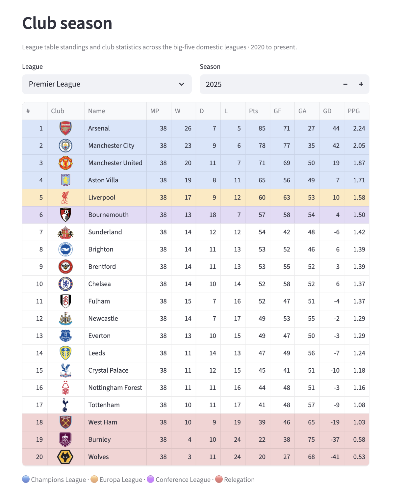

# Football Analytics Platform

A production analytics warehouse for 15 football competitions — built with Python, PySpark, dbt, and Databricks. Real API data, layered transformations, 18 reporting marts, and three consumption layers.

**[Portfolio site](https://football-analytics-dbt.vercel.app)** · **[Case study](https://football-analytics-dbt.vercel.app/case-study)** · **[Gallery](https://football-analytics-dbt.vercel.app/gallery)**

---



---

## What this is

This is not a tutorial project. It is a systems-thinking exercise about architecture, modelling tradeoffs, and what happens when a domain actively resists your assumptions.

Football turns out to be an unusually hostile domain for a data modeller. A player can represent both club and country simultaneously. A competition can behave like a round-robin league in one phase and a knockout tournament in the next. Cup competitions quietly distort aggregated statistics if folded into league reporting without discipline. Every one of these is a modelling problem wearing a football shirt.

The further I went, the less this remained a data pipeline project and the more it became a platform architecture problem.

Full story: **[portfolio site](https://football-analytics-dbt.vercel.app)** · Full technical depth: **[case study](docs/case-study.md)**

---

## Platform at a glance

| | |
|---|---|
| **Competitions** | 15 (Premier League, La Liga, Serie A, Bundesliga, Ligue 1, UCL, World Cup, Euros, domestic cups) |
| **Seasons** | 2020 → present |
| **Players tracked** | 41,000+ |
| **dbt models** | 66 (17 staging · 14 intermediate · 5 dim · 12 fact · 18 marts) |
| **Warehouse** | Databricks Delta Lake (`efua_data_platform`) |
| **Orchestration** | Databricks Jobs DAG (ingest → dbt → test → snapshot) |

---

## Architecture

```text
API-Football
     ↓
Python + PySpark ingestion (scripts/ingestion/)
     ↓
football_raw          19 Delta tables + ingestion_metadata
     ↓
football_staging      17 × stg_*   (clean, type, dedupe)
     ↓
football_intermediate 14 × int_*   (campaign logic, period modelling)
     ↓
football_core         5 dim_* + 12 fact_*   (star schema)
     ↓
football_marts        18 × mart_*  (one grain per business question)
     ↓
Streamlit · LookML · MetricFlow
```

Snapshots run separately: `scd_player_club`, `scd_club_league` (audit / Type 2).

Full ASCII flowchart: **[`docs/architecture.md`](docs/architecture.md)**

---

## Marts (18)

| Domain | Models |
|---|---|
| **Domestic league** | `mart_club_season`, `mart_player_season`, `mart_club_matchday`, `mart_player_matchday`, `mart_league_week`, `mart_league_standings`, `mart_domestic_league_top_scorers` |
| **Cups & Europe** | `mart_club_domestic_cup_performance`, `mart_club_european_performance`, `mart_club_honours` |
| **International** | `mart_national_team_results`, `mart_national_team_honours`, `mart_world_cup`, `mart_continental_cups` |
| **Transfers & value** | `mart_transfer_window`, `mart_player_valuation`, `mart_player_value_changes`, `mart_club_squad_value` |

Consumption rule: query `dim_*`, `fact_*`, `mart_*` — never `int_*` or snapshots in dashboards.

Full grain specs and SQL patterns: **[`models/marts/README.md`](models/marts/README.md)**

---

## Repo structure

```text
football-analytics-dbt/
├── models/
│   ├── staging/          → football_staging
│   ├── intermediate/     → football_intermediate
│   ├── core/             → football_core (dims + facts)
│   ├── marts/            → football_marts (18 tables)
│   ├── ops/              → football_ops
│   └── semantic/         → football_semantic (MetricFlow + time spine)
├── snapshots/            → scd_player_club, scd_club_league
├── macros/               → e.g. parse_transfer_fee_eur
├── scripts/ingestion/    → API-Football → Delta raw
├── app/                  → Streamlit application
├── looker/               → LookML explores
├── portfolio-site/       → Next.js portfolio site
└── docs/                 → case study, ADRs, architecture, data catalog
```

---

## Consumption layers

| Layer | Location | What it covers |
|---|---|---|
| **Streamlit** | [`app/`](app/) | Club season, player season, transfers, honours, European campaigns, squad value, ops |
| **LookML** | [`looker/`](looker/) | 8 explores including `mart_club_european_performance` |
| **MetricFlow** | [`models/semantic/`](models/semantic/) | 7 semantic models, ~21 metrics |

All three consume the same mart layer. Screenshots: **[gallery](https://football-analytics-dbt.vercel.app/gallery)**

### Run Streamlit locally

```bash
cd app
python3 -m venv app-env && source app-env/bin/activate
pip install -r requirements.txt
cp .env.example .env   # add Databricks SQL warehouse credentials
streamlit run streamlit_app.py
```

Requires access to a Databricks workspace with the marts built. Details: [`app/README.md`](app/README.md)

---

## Run dbt

Requires `profiles.yml` for Databricks (not committed). From project root:

```bash
dbt run --select path:models/staging path:models/intermediate
dbt run --select path:models/core
dbt run --select path:models/marts
dbt run --select path:models/ops path:models/semantic
dbt snapshot --select scd_player_club scd_club_league
dbt test --select path:models/core path:models/marts path:models/ops
```

Orchestration in production: Databricks Jobs DAG — see [ADR 007](docs/adr/007-databricks-jobs-over-airflow.md)

---

## Ingestion setup

1. Clone repo and install dependencies (`dbt-databricks` + `scripts/ingestion/requirements.txt`)
2. Configure `profiles.yml` for your Databricks catalog and schemas
3. Create `scripts/config.py` with `API_FOOTBALL_KEY` (not committed — see `.gitignore`)
4. Run ingestion scripts or Databricks Jobs DAG
5. Run dbt build, then Streamlit or BI

Competition IDs: [`scripts/ingestion/constants.py`](scripts/ingestion/constants.py)

---

## Key design decisions

| Decision | Where |
|---|---|
| Databricks Jobs over Airflow at this stage | [ADR 007](docs/adr/007-databricks-jobs-over-airflow.md) |
| Transfers modelled as periods, not Type 2 snapshots | [ADR 011](docs/adr/011-transfers-as-periods-not-type-2-snapshot.md) |
| Coach models dropped — source data quality failure | [ADR 009](docs/adr/009-drop-coach-models-source-data-quality-failure.md) |
| Skipped API team season stats — derived in dbt instead | [ADR 005](docs/adr/005-skipped-team-statistics.md) |

Full ADR index: [`docs/README.md`](docs/README.md)

---

## Out of scope (v1, by design)

- Coach analytics — upstream data quality failure, see ADR 009
- National teams beyond World Cup and Euros — no AFCON or Copa América in v1
- Full MetricFlow and LookML coverage of all 18 marts — demo slice only
- Bronze-layer replayability — flattened at ingestion; tradeoff documented in case study

---

## Documentation

| Document | What it covers |
|---|---|
| [Case study](docs/case-study.md) | Architecture, ingestion, scale, modelling, data quality, observability |
| [Architecture](docs/architecture.md) | End-to-end data flow and orchestration DAG |
| [Data catalog](docs/data-catalog.md) | All 18 marts — grain, business question, freshness |
| [Marts README](models/marts/README.md) | SQL patterns, grain specs, UCL round label mapping |
| [Portfolio story](docs/football_analytics_story.md) | Human narrative behind the build |

---

## Data

Data sourced from [API-Football](https://www.api-football.com/). Respect their terms of service for public demos and any product use.
